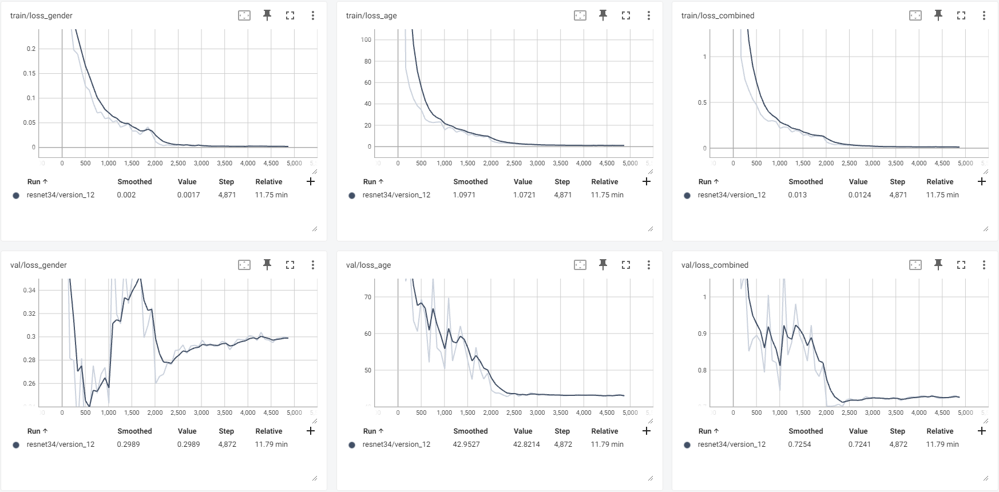

# Age and Gender Recognition

This repository contains code to train and deploy a Neural Network using PyTorch Lightning. This network is a multi-task network, meaning it is designed to predict multiple things at once. In this case, the network is designed to predict both age and gender from an image. The decision to use this style of network to predict both simultaneously was made because there are many similarities between the two tasks. Research also shows that multi-task learning can act as a form of regularization and help the network generalize better.

## Dataset

For training we have decided to use the popular [UTKFace dataset](https://www.kaggle.com/datasets/jangedoo/utkface-new) which is a large-scale face dataset with long age span (range from 0 to 116 years old). The dataset consists of over 20,000 face images with annotations of age, gender, and ethnicity. The images cover large variation in pose, facial expression, illumination, occlusion, resolution, etc. For training, we have a `scripts/generate_metadata.py` script which balances out the age distribution across genders to avoid an unbalanced dataset.

## Architecture

The model architecture is a ResNet backbone. Multiple different versions of ResNets have been trialed in the hyperparameter tuning loop, but the best performing one was the ResNet-34. This ResNet is then connected to two head blocks, each head block is a 2-layer fully connected Neural Network which outputs the age and gender predictions respectively. So, the network simultaneously performs a regression task on the age head and a classification task on the gender head.

## Optimisation

To optimise this network, we have a Cross Entropy loss for the gender head and a Mean Squared Error (MSE) loss for the age head. Obviously, for Backpropagation (BP) to work, we need to combine these into a single loss function. To do this, there are many strategies, but we have employed a simple one of weighting the age loss component with 0.1 and the gender loss component with 0.99. This is based on observational findings and the magnitude of MSE vs Cross Entropy. The formula for the final loss is $Combined\_Loss = 0.1*CE\_age + 0.99*MSE\_gender$. We also implemented an ADAM optimizer with a ReduceLROnPlateau scheduler. We also had a model checkpoint based on the best validation loss and we retrain on the whole dataset based on this.

## Serving 

For serving, the model goes through a preprocessing stage where the image passes through a cascade classifier which crops the image to the face region. So, the deployed model can handle any images as long as they contain one person and a clear view of their face. All info on the serving side can be found in the `serving/` folder.

## Model metrics

Our best model is a ResNet-34 with test metrics of:

- accuracy gender = 0.92
- mean squared error age = 43.43 (on average 6.53 years off)

Below are some of the plots generated for the best performing hyperparameter-tuned iteration. The top row is the training loss metrics and the bottom row is the validation loss metrics. Please note that the model is optimized on the final column, the `loss_combined`.

## Training

1. `poetry run python scripts/generate_metadata.py` - This command generates a metadata file for the images. It creates a pandas DataFrame with all image paths and y-labels, which will be used for the DataLoader in training.
2. `poetry run python scripts/hparam_tuning.py` - This command runs the hyperparameter tuning loop. Default arguments have been set, but you can change these via command-line arguments.
3. `poetry run python scripts/train_production_model.py` - This command trains the final production model. Run this after executing make tensorboard, which is used to evaluate the best hyperparameter run.

## Deploying
Once you have trained your production model, you can move onto deployment. This involves containerizing the FastAPI service in the `serving/` directory and deploying it via GCP's Cloud Run. The stages for this are contained in the Makefile commands. Before running these, please check the path of your production model folder and change the following line in the Makefile: `export MODEL_FOLDER_PATH=tb_logs/production_model/version_2`.

1. `make docker-build` - This command builds the Docker image.
2. `make docker-run` - This command tests if the image runs. You can navigate to localhost to try out the API via FastAPI's UI.
3. `make docker-tag` - This command tags the image correctly so that it can be uploaded to GCP's Artifact Registry.
4. `make docker-push` - This command pushes the tagged image to the Artifact Registry.
5. `make deploy-cloud-run` - This command deploys the pushed image to Cloud Run. Before running this stage, please make sure to change the `IMAGE_NAME` default argument in the Makefile to your image name in GCP's Artifact Registry.

## Tests

To save time, tests have only been created for the client living in `serving/client.py`. To successfully run these tests, please make sure you have a deployed API via Cloud Run and a service account JSON in your root directory to run the `test_cloud_run_endpoint` test, or have the API running locally to run the `test_local_endpoint` test.